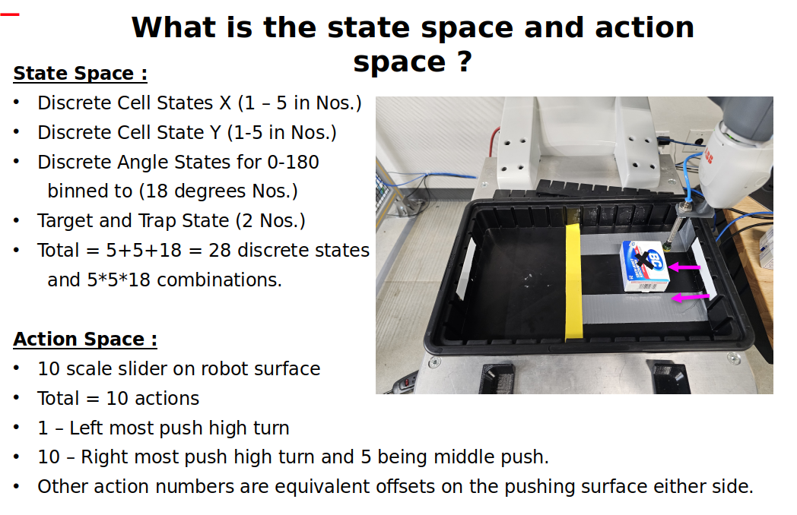
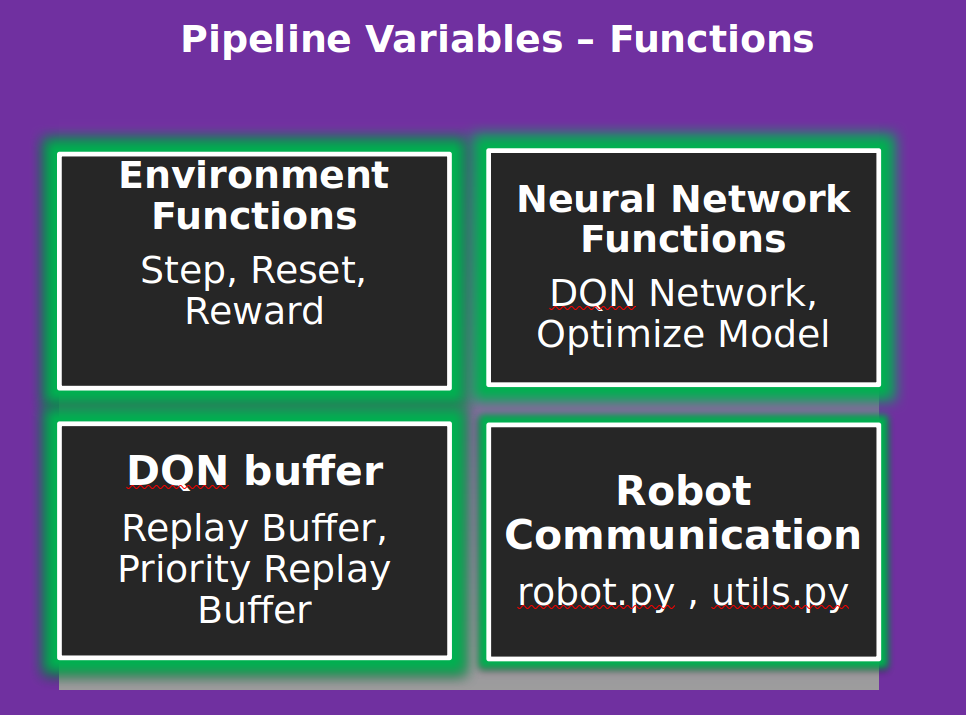
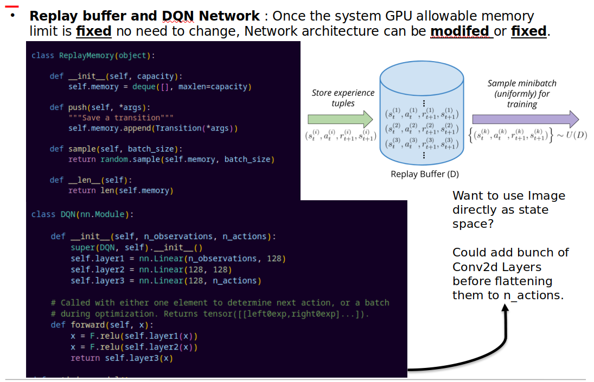

# Implementation of DQN Network in ABB YuMi Manipulator to do planar pushing under external perturbance. 

Pytorch Implementation of Deep Q Network  (DQN) for the ABB YuMi Robot Arm manipulating a block on a plane using an OpenAI Gym environment. The code is designed to train an agent to perform planar pushing task when dealing with external peturbances where the end goal is to reach a goal destination with defined orientation. This project is done to establish and Reinforcement Learning platform to do other tasks like peg in hole assembly and learning ambidextrous object manipulation policies when encountering semi deformable objects.

---

## Tech Stack

- **Language:** `Python`
- **Libraries:** `Pytorch`, `random`, `numpy`, `matplotlib`, `gym`, `matplotlib`, `pandas`, `itertools`,`collections`

---

## Experimental Setup

---

## Environment Setup

## Pipeline Setup

---

## Experience Replay using Priority Buffer for Learning [Prioritized Experience Replay](https://arxiv.org/abs/1511.05952)

